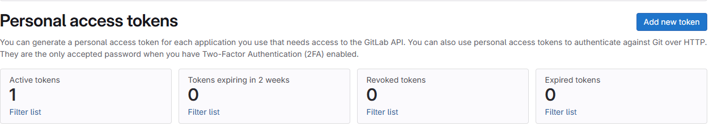
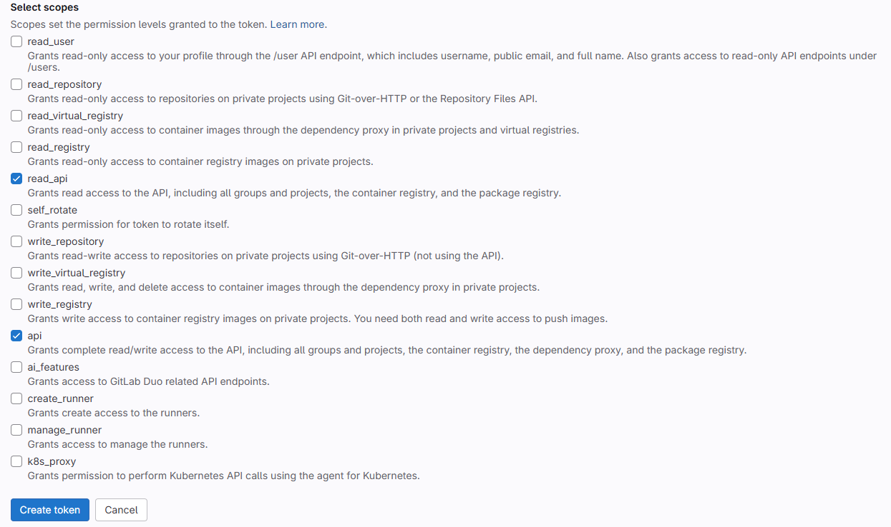
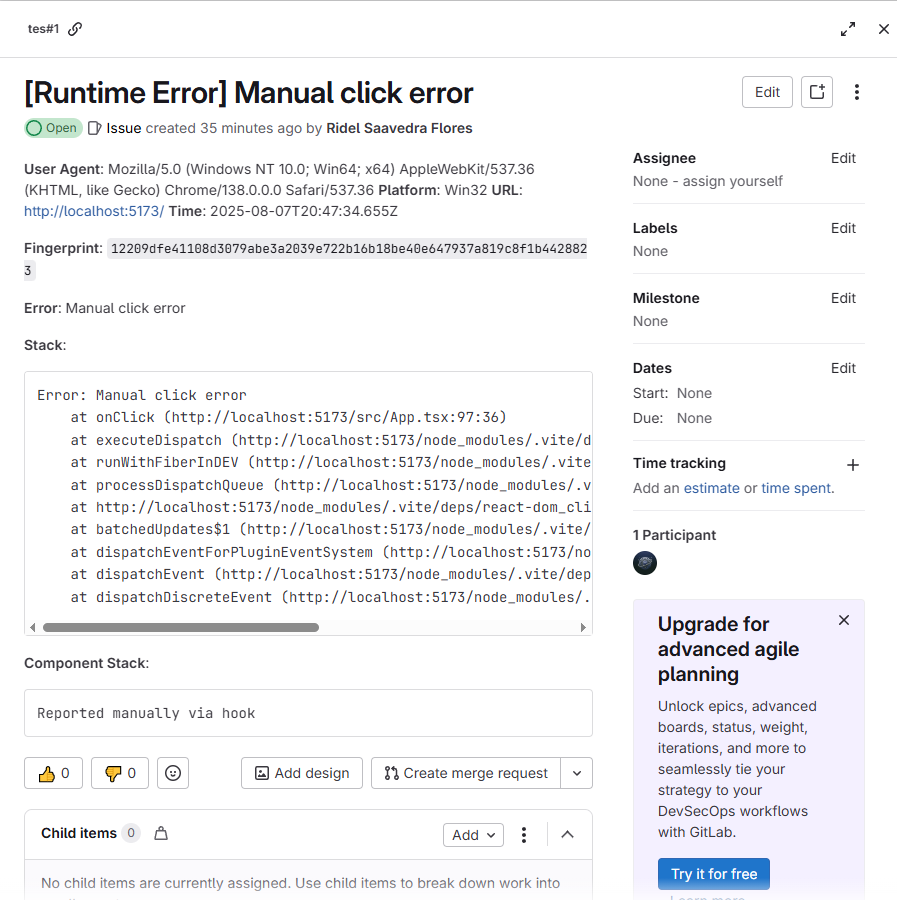

# How to Get the Required Values to Set Up Gitlab Integration

## How to get the apiKey

To obtain the API key, go to your Preferences, then navigate to Access Tokens. Click on Add new token and select the necessary permissions, specifically those related to the API.

---

## How to Get the projectId

To get the **projectId**, simply make a request using curl or directly in the browser to the following URL, replacing **PROJECT_NAME** with the actual name of your project: `https://gitlab.com/api/v4/projects?search=PROJECT_NAME`

---

And that’s it! Once an error is generated, an issue will be automatically created in GitLab.

