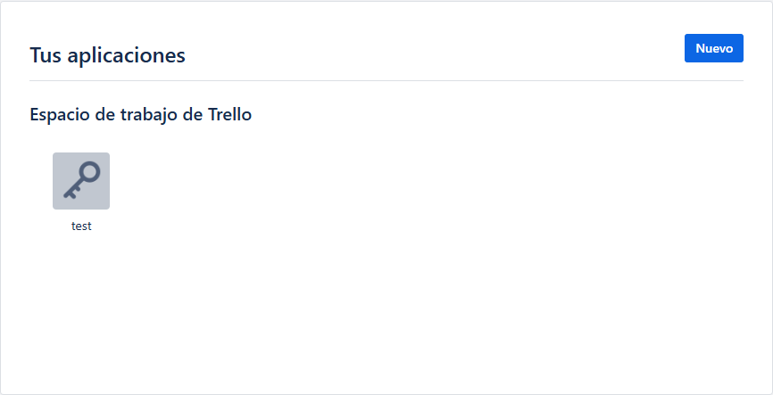
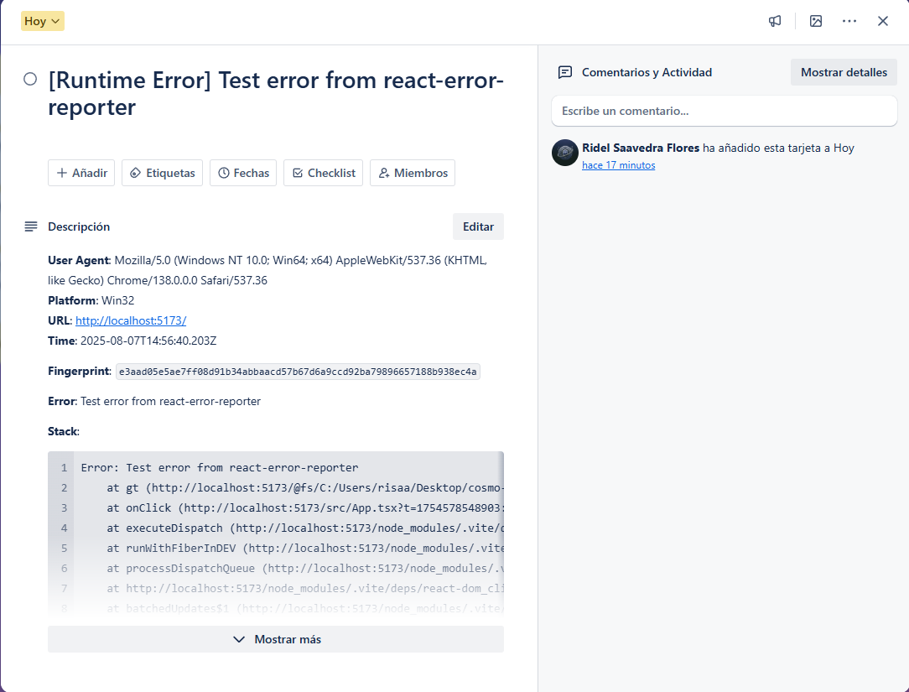

# Basic setup trello provider

```ts
import {
  ErrorBoundary,
  configureReporter,
  enableGlobalCapture,
} from 'cf-react-error-reporter'

configureReporter({
  provider: "trello",
  apiKey: import.meta.env.VITE_GITHUB_TOKEN,
  trelloToken: import.meta.env.VITE_GITHUB_TOKEN,
  trelloBoardId: "BOARD_ID",
  trelloListId: "LIST_ID",
  onlyInProduction: true,
  mode: "frontend", // 'frontend' | 'backend' | 'auto'
});

enableGlobalCapture(); // Enable global error capturing

createRoot(document.getElementById("root")!).render(
  <StrictMode>
    <ErrorBoundary fallback={<div>Something went wrong</div>}>
      <App />
    </ErrorBoundary>
  </StrictMode>
);
```

## Getting the **trelloBoardId**

In your Trello board's URL, you'll see something like: `https://trello.com/b/xeVjRZvE/my-board`, the board ID is `xeVjRZvE`.

---

## How to Get Your **apiKey** and **token**

To get these two, go to [get API key](https://trello.com/app-key).

There, you'll need to create a new **workspace** for your app.



Once you have the API key, click the **"token"** link on the same page to generate your token.

---

## How to Get the **trelloListId**

With your **token** and **API key**, simply paste the following URL into your browser. This will return the lists from your board. Choose the one where issues will be created and copy its ID.

> **URL: `https://api.trello.com/1/boards/BOARD_ID/lists?key=API_KEY&token=TOKEN`**

---

And that’s it! Once an error occurs, an issue will automatically be created in the selected list.


